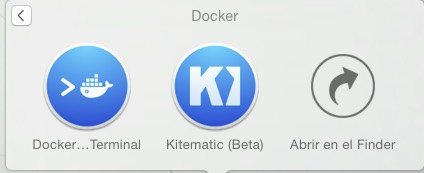

#Docker Template

The purpose of this project is to create a simple docker container to 
develop php application isolated from your sytem and facilitating teams to share the same dev 
environment 

##Prerequisites

The easy way if your system is windows or mac  is going to [docker-toolbox page](https://www.docker.com/docker-toolbox) download and install this tool

As described in that page 

>The Docker Toolbox is an installer to quickly and easily install and setup a Docker environment 
on your computer. Available for both Windows and Mac, the Toolbox installs Docker Client, Machine, Compose, Kitematic and VirtualBox.

Once installed if you'll have two main apps and both of them serve for conect and add docker 

